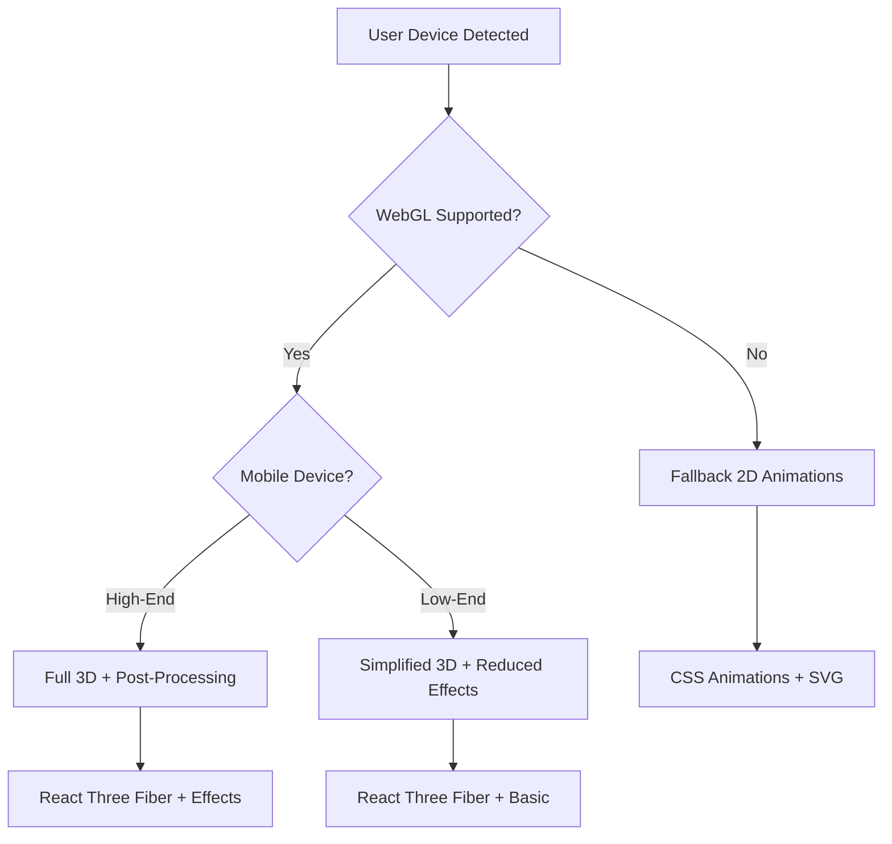
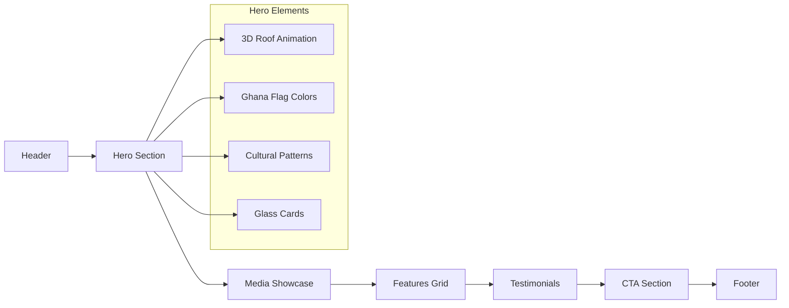
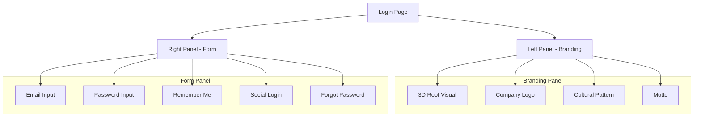
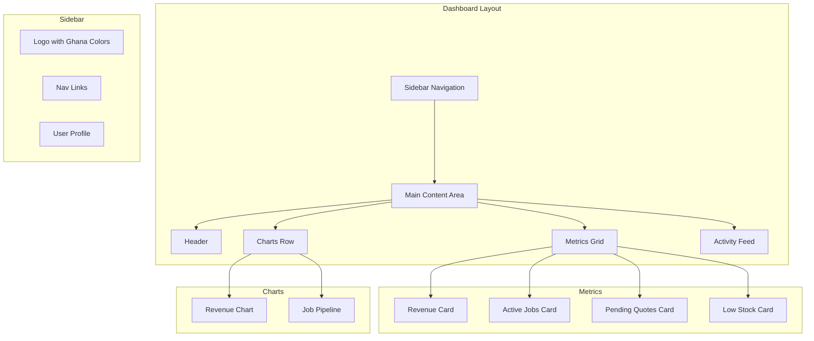

# RoofManager SaaS Platform Redesign - Architectural Design Plan

**Version:** 1.0  
**Date:** February 2025  
**Status:** Draft - Awaiting Approval  
**Target URL:** https://roofmanager1.vercel.app/

---

## 1. Executive Summary

This document outlines the comprehensive architectural design plan for redesigning the RoofManager SaaS platform with Ghanaian cultural elements, liquid glass UI aesthetics, and interactive 3D animations. The redesign aims to create a culturally resonant experience for Ghanaian users while maintaining enterprise-grade functionality and cross-platform compatibility.

The current platform utilizes Next.js 14, TypeScript, Tailwind CSS, and Framer Motion with existing glassmorphism implementations. This redesign will extend the existing foundation with:

- **Ghanaian Cultural Integration**: Color palette inspired by the Ghana flag and traditional Kente cloth patterns
- **Liquid Glass UI**: Enhanced glassmorphism with dynamic blur, refraction, and light effects
- **3D Animations**: Interactive roof and construction visualizations using React Three Fiber
- **Roof-Themed Components**: Design elements reflecting the roofing industry with cultural influences

---

## 2. Visual Design Strategy

### 2.1 Ghanaian Cultural Color Palette

The color system integrates official Ghana flag colors with traditional Kente cloth colors and modern UI requirements.

#### Primary Colors

| Color Name | Hex Code | Usage | Cultural Significance |
|------------|----------|-------|----------------------|
| Ghana Red | `#EF2B2D` | Accent, CTAs, alerts | Courage, blood, sacrificial rites |
| Ghana Gold | `#FFD700` | Highlights, success, premium | Royalty, wealth, spiritual purity |
| Ghana Green | `#009E49` | Primary actions, growth | Agriculture, vegetation |
| Ghana Black | `#000000` | Text, contrast, depth | Death, mourning, spiritual wisdom |

#### Extended Kente Cloth Palette

| Color Name | Hex Code | Usage | Cultural Significance |
|------------|----------|-------|----------------------|
| Kente Yellow | `#F4C430` | Secondary highlights | Femininity, glory, spiritual energy |
| Kente Orange | `#CC7722` | Warnings, attention | Hospitality, impurity |
| Kente Blue | `#0077B6` | Trust, calm, technology | Peace, harmony, spiritual blessings |
| Kente Brown | `#8B4513` | Earth tones, stability | Earthly healing, nature |
| Kente Purple | `#6B3FA0` | Luxury, creativity | Wisdom, royalty, magic |
| Kente Pink | `#E91E63` | Secondary accents | Tenderness, softness |

#### Functional Color System

| Usage | Primary | Secondary | Dark Mode |
|-------|---------|-----------|-----------|
| Background Primary | `#FAFAFA` | `#0F172A` | Slate-950 |
| Background Secondary | `#F1F5F9` | `#1E293B` | Slate-800 |
| Surface (Glass) | `rgba(255,255,255,0.7)` | `rgba(30,41,59,0.7)` | Slate-800/70 |
| Text Primary | `#1E293B` | `#F8FAFC` | Slate-50 |
| Text Secondary | `#64748B` | `#94A3B8` | Slate-400 |
| Border | `#E2E8F0` | `#334155` | Slate-700 |
| Primary Action | `#009E49` (Green) | `#009E49` | Green-500 |
| Secondary Action | `#FFD700` (Gold) | `#FFD700` | Gold-500 |
| Danger | `#EF2B2D` (Red) | `#EF2B2D` | Red-500 |
| Success | `#10B981` | `#10B981` | Emerald-500 |

### 2.2 Typography System

#### Primary Font: Inter

The Inter font family provides excellent readability for UI elements and supports the Ghanaian user base with comprehensive character sets.

| Element | Size | Weight | Line Height | Letter Spacing |
|---------|------|--------|-------------|----------------|
| Display | 64px | Bold | 1.1 | -0.02em |
| H1 | 48px | Bold | 1.2 | -0.01em |
| H2 | 36px | SemiBold | 1.3 | 0 |
| H3 | 24px | SemiBold | 1.4 | 0 |
| H4 | 20px | Medium | 1.4 | 0 |
| Body Large | 18px | Regular | 1.6 | 0 |
| Body | 16px | Regular | 1.6 | 0 |
| Body Small | 14px | Regular | 1.5 | 0 |
| Caption | 12px | Regular | 1.4 | 0.01em |

#### Secondary Font: Noto Sans

For headings and display text requiring more cultural character, Noto Sans provides additional personality while maintaining readability.

### 2.3 Liquid Glass UI Specifications

The liquid glass system extends the existing glassmorphism foundation with dynamic light effects, refractions, and movement.

#### CSS Custom Properties

```css
:root {
  /* Glass Base */
  --glass-bg-light: rgba(255, 255, 255, 0.15);
  --glass-bg-medium: rgba(255, 255, 255, 0.25);
  --glass-bg-dark: rgba(255, 255, 255, 0.35);
  --glass-bg-gold: rgba(255, 215, 0, 0.15);
  --glass-bg-green: rgba(0, 158, 73, 0.15);
  
  /* Glass Borders */
  --glass-border-light: rgba(255, 255, 255, 0.2);
  --glass-border-medium: rgba(255, 255, 255, 0.35);
  --glass-border-gold: rgba(255, 215, 0, 0.4);
  --glass-border-green: rgba(0, 158, 73, 0.4);
  
  /* Glass Shadows */
  --glass-shadow: 0 8px 32px 0 rgba(31, 38, 135, 0.25);
  --glass-shadow-gold: 0 8px 32px 0 rgba(255, 215, 0, 0.2);
  --glass-shadow-green: 0 8px 32px 0 rgba(0, 158, 73, 0.2);
  --glass-shadow-lg: 0 16px 48px 0 rgba(31, 38, 135, 0.35);
  
  /* Blur Levels */
  --glass-blur-sm: 8px;
  --glass-blur-md: 12px;
  --glass-blur-lg: 16px;
  --glass-blur-xl: 24px;
  
  /* Liquid Effects */
  --liquid-flow: 3s ease-in-out infinite;
  --liquid-intensity: 0.15;
  --liquid-refraction: 1.1;
}

/* Dark Mode */
.dark {
  --glass-bg-light: rgba(0, 0, 0, 0.25);
  --glass-bg-medium: rgba(0, 0, 0, 0.4);
  --glass-bg-dark: rgba(0, 0, 0, 0.5);
  --glass-border-light: rgba(255, 255, 255, 0.08);
  --glass-border-medium: rgba(255, 255, 255, 0.15);
  --glass-shadow: 0 8px 32px 0 rgba(0, 0, 0, 0.5);
  --glass-shadow-gold: 0 8px 32px 0 rgba(255, 215, 0, 0.15);
  --glass-shadow-green: 0 8px 32px 0 rgba(0, 158, 73, 0.15);
}
```

#### Glass Component Classes

```css
/* Base Liquid Glass */
.glass-liquid {
  background: var(--glass-bg-light);
  backdrop-filter: blur(var(--glass-blur-md)) saturate(150%);
  -webkit-backdrop-filter: blur(var(--glass-blur-md)) saturate(150%);
  border: 1px solid var(--glass-border-light);
  box-shadow: var(--glass-shadow);
  position: relative;
  overflow: hidden;
}

.glass-liquid::before {
  content: '';
  position: absolute;
  inset: 0;
  background: linear-gradient(
    135deg,
    rgba(255,255,255,0.1) 0%,
    rgba(255,255,255,0) 50%,
    rgba(255,255,255,0.05) 100%
  );
  pointer-events: none;
}

/* Gold Accent Glass */
.glass-gold {
  background: var(--glass-bg-gold);
  backdrop-filter: blur(var(--glass-blur-md)) saturate(150%);
  -webkit-backdrop-filter: blur(var(--glass-blur-md)) saturate(150%);
  border: 1px solid var(--glass-border-gold);
  box-shadow: var(--glass-shadow-gold);
}

/* Green Accent Glass */
.glass-green {
  background: var(--glass-bg-green);
  backdrop-filter: blur(var(--glass-blur-md)) saturate(150%);
  -webkit-backdrop-filter: blur(var(--glass-blur-md)) saturate(150%);
  border: 1px solid var(--glass-border-green);
  box-shadow: var(--glass-shadow-green);
}

/* Glass Card Variants */
.glass-card {
  @apply rounded-2xl p-6 glass-liquid;
  transition: transform 0.3s ease, box-shadow 0.3s ease;
}

.glass-card-interactive {
  @apply glass-card cursor-pointer;
  transition: transform 0.3s ease, box-shadow 0.3s ease, border-color 0.3s ease;
}

.glass-card-interactive:hover {
  transform: translateY(-4px);
  box-shadow: var(--glass-shadow-lg);
  border-color: var(--glass-border-medium);
}

/* Glass Button */
.glass-btn {
  @apply px-6 py-3 rounded-xl font-medium transition-all duration-300;
  background: var(--glass-bg-light);
  backdrop-filter: blur(var(--glass-blur-sm));
  -webkit-backdrop-filter: blur(var(--glass-blur-sm));
  border: 1px solid var(--glass-border-light);
}

.glass-btn:hover {
  background: var(--glass-bg-medium);
  border-color: var(--glass-border-medium);
  transform: translateY(-2px);
  box-shadow: var(--glass-shadow);
}

.glass-btn-primary {
  @apply glass-btn;
  background: linear-gradient(
    135deg,
    rgba(0, 158, 73, 0.3),
    rgba(0, 158, 73, 0.1)
  );
  border-color: var(--glass-border-green);
}

.glass-btn-gold {
  @apply glass-btn;
  background: linear-gradient(
    135deg,
    rgba(255, 215, 0, 0.3),
    rgba(255, 215, 0, 0.1)
  );
  border-color: var(--glass-border-gold);
}

/* Glass Input */
.glass-input {
  @apply w-full px-4 py-3 rounded-xl transition-all duration-300;
  background: var(--glass-bg-light);
  backdrop-filter: blur(var(--glass-blur-sm));
  -webkit-backdrop-filter: blur(var(--glass-blur-sm));
  border: 1px solid var(--glass-border-light);
}

.glass-input:focus {
  outline: none;
  border-color: rgba(255, 215, 0, 0.5);
  box-shadow: 0 0 0 3px rgba(255, 215, 0, 0.1);
}
```

#### Animated Liquid Effects

```css
/* Flowing Liquid Animation */
@keyframes liquidFlow {
  0%, 100% {
    transform: translateX(0) translateY(0) scale(1);
    filter: blur(0px);
  }
  25% {
    transform: translateX(-5px) translateY(5px) scale(1.02);
    filter: blur(1px);
  }
  50% {
    transform: translateX(5px) translateY(-5px) scale(0.98);
    filter: blur(2px);
  }
  75% {
    transform: translateX(5px) translateY(5px) scale(1.01);
    filter: blur(1px);
  }
}

.animate-liquid {
  animation: liquidFlow 8s ease-in-out infinite;
}

/* Shimmer Effect */
@keyframes shimmer {
  0% {
    background-position: -200% 0;
  }
  100% {
    background-position: 200% 0;
  }
}

.animate-shimmer {
  background: linear-gradient(
    90deg,
    transparent,
    rgba(255,255,255,0.3),
    transparent
  );
  background-size: 200% 100%;
  animation: shimmer 2s infinite;
}

/* Aurora Glow Effect */
@keyframes auroraGlow {
  0%, 100% {
    opacity: 0.3;
    transform: translateX(0) translateY(0);
  }
  25% {
    opacity: 0.5;
    transform: translateX(10px) translateY(-10px);
  }
  50% {
    opacity: 0.4;
    transform: translateX(-10px) translateY(10px);
  }
  75% {
    opacity: 0.6;
    transform: translateX(10px) translateY(10px);
  }
}

.animate-aurora {
  animation: auroraGlow 6s ease-in-out infinite;
}
```

### 2.4 3D Animation Implementation Strategy

The 3D animation strategy balances visual impact with performance, using a tiered approach based on device capabilities.

#### Recommended Libraries

| Library | Purpose | Why Selected |
|---------|---------|--------------|
| React Three Fiber | React renderer for Three.js | Declarative 3D in React, excellent performance |
| React Three Drei | Helper components for R3F | Ready-made abstractions for common 3D patterns |
| Spline | Design tool + runtime | Easy 3D/2D animations, interactive scenes |
| Framer Motion | UI animations | Already in use, excellent for DOM-based 3D effects |
| React Spring | Physics-based animations | Natural-feeling animations for UI interactions |

#### Tiered 3D Rendering Strategy



**Tier 1 - Full 3D Experience (Desktop, High-End Mobile)**
- Complex 3D roof models with materials
- Post-processing effects (bloom, depth of field)
- Real-time lighting and shadows
- Interactive camera controls

**Tier 2 - Simplified 3D (Mid-Range Mobile)**
- Low-poly 3D models
- Basic lighting without shadows
- Reduced post-processing
- Limited interactivity

**Tier 3 - Fallback (Low-End Devices, No WebGL)**
- CSS-based 3D transforms
- Animated SVG illustrations
- Lottie animations
- Static imagery with effects

#### 3D Performance Budget

| Metric | Target | Monitoring |
|--------|--------|------------|
| Frame Rate | 60 FPS (30 FPS minimum) | Chrome DevTools Performance |
| Load Time | < 3 seconds for 3D assets | Lighthouse |
| Memory | < 100MB for 3D scene | Chrome Task Manager |
| GPU Time | < 16ms per frame | Three.js stats |

#### React Three Fiber Component Structure

```
components/
└── 3d/
    ├── scenes/
    │   ├── RoofScene.tsx      # Main 3D roof visualization
    │   ├── HeroScene.tsx      # Landing page 3D background
    │   └── DashboardScene.tsx # Dashboard 3D elements
    ├── models/
    │   ├── RoofModel.tsx      # 3D roof component
    │   ├── TileModel.tsx      # Shingle/tile models
    │   └── ConstructionModel.tsx # Construction scene
    ├── effects/
    │   ├── LiquidGlass.tsx    # Glass refraction effect
    │   ├── GhanaPattern.tsx   # Cultural pattern overlays
    │   └── Lighting.tsx        # Lighting setup
    └── utils/
        ├── use3DPerformance.ts # Performance monitoring
        └── modelLoader.ts      # Asset loading utilities
```

### 2.5 Roof-Themed Design Elements

The roofing industry theme is integrated through architectural shapes, textures, and visual metaphors.

#### Roof Shape Components

```tsx
// components/ui/roof-shapes.tsx
import { cn } from '@/lib/utils';

export function RoofCorner({ className, color = 'green' }: { className?: string; color?: 'green' | 'gold' | 'red' }) {
  const colors = {
    green: 'border-ghana-green bg-ghana-green/20',
    gold: 'border-ghana-gold bg-ghana-gold/20',
    red: 'border-ghana-red bg-ghana-red/20',
  };
  
  return (
    <div className={cn(
      'w-16 h-16 border-t-4 border-l-4 rounded-tl-xl',
      colors[color],
      className
    )} />
  );
}

export function RoofBadge({ children, variant = 'green' }: { children: React.ReactNode; variant?: 'green' | 'gold' | 'red' | 'black' }) {
  const variants = {
    green: 'bg-ghana-green text-white',
    gold: 'bg-ghana-gold text-black',
    red: 'bg-ghana-red text-white',
    black: 'bg-ghana-black text-white',
  };
  
  return (
    <span className={cn(
      'px-3 py-1 rounded-full text-sm font-bold',
      variants[variant]
    )}>
      {children}
    </span>
  );
}
```

#### Kente Pattern Integration

```css
/* Kente-inspired decorative patterns */
.kente-pattern {
  background-image: url('/patterns/kente-light.svg');
  background-repeat: repeat;
  opacity: 0.1;
}

.kente-border {
  border: 2px solid transparent;
  background: 
    linear-gradient(var(--glass-bg-light), var(--glass-bg-light)) padding-box,
    linear-gradient(90deg, 
      #EF2B2D 0%, 
      #FFD700 25%, 
      #009E49 50%, 
      #000000 75%, 
      #EF2B2D 100%
    ) border-box;
  border-radius: 8px;
}

/* Roof tile texture overlay */
.roof-tile-texture {
  background-image: url('/textures/tile-pattern.png');
  background-repeat: repeat;
  opacity: 0.05;
}

/* Shingle pattern */
.shingle-pattern {
  background: 
    linear-gradient(45deg, transparent 48%, rgba(0,0,0,0.1) 48%, rgba(0,0,0,0.1) 52%, transparent 52%),
    linear-gradient(-45deg, transparent 48%, rgba(0,0,0,0.1) 48%, rgba(0,0,0,0.1) 52%, transparent 52%);
  background-size: 20px 20px;
}
```

---

## 3. Page-by-Page Design Specifications

### 3.1 Landing Page

**File:** `frontend/app/page.tsx`

#### Design Overview

The landing page combines Ghanaian cultural elements with modern liquid glass aesthetics to create an immersive first impression for Ghanaian users.



#### Hero Section Specifications

| Element | Specification |
|---------|---------------|
| Height | 90vh minimum |
| Background | Animated gradient with Ghana colors |
| 3D Element | Rotating roof model with lighting effects |
| Typography | Display font, gradient text fill |
| CTA Buttons | Primary (Green), Secondary (Gold/Glass) |
| Animation | Staggered fade-in, parallax scroll |

#### Landing Page Implementation

```tsx
// Hero Section Structure
export function HeroSection() {
  return (
    <section className="relative min-h-screen flex items-center justify-center overflow-hidden">
      {/* Animated Background */}
      <div className="absolute inset-0 bg-gradient-to-br from-ghana-green/10 via-slate-950 to-ghana-gold/10" />
      <div className="absolute inset-0 kente-pattern opacity-5" />
      
      {/* Aurora Glow Effects */}
      <div className="absolute top-1/4 left-1/4 w-96 h-96 bg-ghana-green/20 rounded-full blur-3xl animate-liquid" />
      <div className="absolute bottom-1/4 right-1/4 w-80 h-80 bg-ghana-gold/20 rounded-full blur-3xl animate-liquid" style={{ animationDelay: '2s' }} />
      
      {/* 3D Roof Animation */}
      <div className="absolute inset-0 z-0">
        <Suspense fallback={<HeroAnimationFallback />}>
          <RoofModel tier="full" colorScheme="night" interactive />
        </Suspense>
      </div>
      
      {/* Content */}
      <div className="container relative z-10 px-4 mx-auto">
        <motion.div
          initial={{ opacity: 0, y: 30 }}
          animate={{ opacity: 1, y: 0 }}
          transition={{ duration: 0.8 }}
          className="text-center"
        >
          {/* Badge */}
          <GlassBadge variant="gold" className="mb-6">
            <span className="w-2 h-2 bg-ghana-red rounded-full animate-pulse mr-2" />
            Made for Ghanaian Contractors
          </GlassBadge>
          
          {/* Heading */}
          <h1 className="text-5xl md:text-7xl font-bold text-white mb-6">
            <span className="drop-shadow-lg">Roofing Management</span>
            <br />
            <span className="text-transparent bg-clip-text bg-gradient-to-r from-ghana-green via-ghana-gold to-ghana-red">
              Reimagined
            </span>
          </h1>
          
          {/* Subheading */}
          <p className="mx-auto max-w-[700px] text-lg md:text-xl text-white/70 mb-8">
            The all-in-one platform built for Ghanaian roofing professionals.
            Estimate, schedule, and grow your business with confidence.
          </p>
          
          {/* CTAs */}
          <div className="flex flex-wrap items-center justify-center gap-4">
            <Button asChild size="lg" className="glass-btn-primary text-white">
              <Link href="/register">
                Start Free Trial
                <ArrowRight className="ml-2 h-5 w-5" />
              </Link>
            </Button>
            <Button asChild size="lg" variant="outline" className="glass-btn text-white border-white/30">
              <Link href="/login">
                <Play className="mr-2 h-5 w-5" />
                Watch Demo
              </Link>
            </Button>
          </div>
          
          {/* Trust Badges */}
          <div className="flex items-center justify-center gap-8 mt-12 text-white/50">
            <TrustBadge icon={Check}>No credit card required</TrustBadge>
            <TrustBadge icon={Check}>14-day free trial</TrustBadge>
            <TrustBadge icon={Check}>Ghanaian support</TrustBadge>
          </div>
        </motion.div>
      </div>
    </section>
  );
}
```

#### Feature Cards with Roof Theme

```tsx
// FeatureCard Component with Roof Pattern
export function FeatureCard({ 
  title, 
  description, 
  icon: Icon,
  pattern = 'tile'
}: FeatureCardProps) {
  return (
    <motion.div
      whileHover={{ scale: 1.02, y: -5 }}
      className="glass-card relative overflow-hidden"
    >
      {/* Roof Tile Pattern Overlay */}
      <div className={`absolute inset-0 roof-${pattern}-texture opacity-30 pointer-events-none`} />
      
      {/* Accent Border */}
      <div className="absolute top-0 left-0 right-0 h-1 bg-gradient-to-r from-ghana-green via-ghana-gold to-ghana-red" />
      
      {/* Content */}
      <div className="relative z-10">
        <div className="w-14 h-14 rounded-2xl bg-gradient-to-br from-ghana-green/20 to-ghana-gold/20 flex items-center justify-center mb-4">
          <Icon className="w-7 h-7 text-ghana-green" />
        </div>
        
        <h3 className="text-xl font-bold text-white mb-2">{title}</h3>
        <p className="text-white/70">{description}</p>
      </div>
      
      {/* Decorative Corner */}
      <RoofCorner className="absolute bottom-0 right-0 rounded-tr-none rounded-bl-none" color="gold" />
    </motion.div>
  );
}
```

### 3.2 Login Page

**File:** `frontend/app/(auth)/login/page.tsx`

#### Design Overview

The login page incorporates Ghanaian cultural elements while maintaining professional credibility for business users.



#### Login Page Layout

The login page features a split layout with cultural branding on the left and a glassmorphism form on the right. Key features include:

- 3D roof visualization in the branding panel
- Kente cloth pattern background
- Ghana flag accent colors
- Mobile money login option (popular in Ghana)
- Google and Microsoft social login
- Glassmorphism input fields
- Password recovery link
- Remember me functionality

### 3.3 CRM Dashboard

**File:** `frontend/app/(dashboard)/dashboard/page.tsx`

#### Design Overview

The dashboard combines the Ghanaian color palette with roof-themed elements to create a professional yet culturally resonant workspace.



#### Dashboard Specifications

The dashboard includes:

- Header with date display and quick actions
- Glass metric cards with Ghana color accents
- Revenue chart with glassmorphism styling
- Job pipeline visualization
- Recent activity feed
- Roof-themed navigation sidebar
- User profile section

---

## 4. Cross-Platform Compatibility Strategy

### 4.1 Browser Support Matrix

| Browser | Minimum Version | Tier | Notes |
|---------|----------------|------|-------|
| Chrome | 90+ | Full | Best WebGL 2.0 support |
| Firefox | 88+ | Full | Good WebGL support |
| Safari | 15+ | Simplified | Limited WebGL performance |
| Edge | 90+ | Full | Chromium-based |
| Samsung Internet | 15+ | Simplified | Mobile WebGL varies |
| Opera | 76+ | Full | Chromium-based |
| iOS Safari | 15+ | Simplified | Battery considerations |
| Android Chrome | 90+ | Simplified | Performance varies |

### 4.2 Device Breakpoints

| Breakpoint | Width | Target | Strategy |
|------------|-------|--------|----------|
| xs | 0-639px | Mobile phones | Stack layout, simplified 3D |
| sm | 640-767px | Large phones | Horizontal cards |
| md | 768-1023px | Tablets | Grid layouts |
| lg | 1024-1279px | Laptops | Full features, full 3D |
| xl | 1280-1535px | Desktops | Full features, enhanced 3D |
| 2xl | 1536px+ | Large screens | Full features, multi-view |

### 4.3 Performance Degradation Strategy

The application detects device capabilities and adjusts the experience accordingly:

1. **High-End Devices**: Full 3D models with post-processing, complex animations
2. **Mid-Range Devices**: Simplified 3D models, reduced lighting effects
3. **Low-End Devices**: CSS animations, SVG illustrations, static images

### 4.4 Progressive Enhancement Approach

1. **Core Experience (Baseline)**: Semantic HTML, CSS-only animations, form functionality, keyboard navigation
2. **Enhanced Experience (JavaScript)**: React hydration, client-side routing, interactive components
3. **Full Experience (Modern Browsers)**: WebGL 3D graphics, advanced animations, background sync
4. **Premium Experience (High-End Devices)**: Full 3D with post-processing, particle effects, real-time collaboration

---

## 5. Technical Implementation Recommendations

### 5.1 Recommended Libraries and Frameworks

| Category | Current | Recommended | Justification |
|----------|---------|-------------|---------------|
| UI Framework | Next.js 14 | Next.js 14 | Already in use, excellent performance |
| Styling | Tailwind CSS | Tailwind CSS + CSS Variables | Already in use, extend for glassmorphism |
| UI Components | shadcn/ui | shadcn/ui | Already in use, customizable |
| 3D Graphics | Framer Motion | React Three Fiber + Spline | Better 3D capabilities |
| Animations | Framer Motion | Framer Motion + React Spring | Already in use, add physics |
| State | Zustand | Zustand | Already in use |
| Forms | React Hook Form | React Hook Form + Zod | Already in use |
| Data Fetching | TanStack Query | TanStack Query | Already in use |
| Charts | Recharts | Recharts | Already in use |

### 5.2 New Dependencies

```json
{
  "dependencies": {
    "@react-three/fiber": "^8.15.0",
    "@react-three/drei": "^9.92.0",
    "three": "^0.160.0",
    "@splinetool/react-spline": "^2.2.0",
    "react-spring": "^9.7.0"
  },
  "devDependencies": {
    "@types/three": "^0.160.0"
  }
}
```

### 5.3 Component Library Structure

```
components/
├── ui/
│   ├── glass/                    # Glassmorphism components
│   │   ├── GlassCard.tsx
│   │   ├── GlassButton.tsx
│   │   ├── GlassInput.tsx
│   │   ├── GlassBadge.tsx
│   │   └── GlassModal.tsx
│   ├── roof/                     # Roof-themed components
│   │   ├── RoofCorner.tsx
│   │   ├── RoofBadge.tsx
│   │   ├── RoofPattern.tsx
│   │   └── RoofVisual.tsx
│   ├── ghana/                     # Ghanaian cultural components
│   │   ├── GhanaFlag.tsx
│   │   ├── KentePattern.tsx
│   │   └── AdinkraIcon.tsx
│   └── layout/
│       ├── PerformanceAware.tsx
│       ├── ResponsiveGrid.tsx
│       └── AnimationController.tsx
│
├── 3d/                           # 3D components
│   ├── scenes/
│   │   ├── HeroScene.tsx
│   │   ├── RoofScene.tsx
│   │   └── DashboardScene.tsx
│   ├── models/
│   │   ├── RoofModel.tsx
│   │   ├── TileModel.tsx
│   │   └── ConstructionModel.tsx
│   ├── effects/
│   │   ├── LiquidGlass.tsx
│   │   ├── GhanaPattern3D.tsx
│   │   └── Lighting.tsx
│   └── utils/
│       ├── use3DPerformance.ts
│       ├── modelLoader.ts
│       └── sceneOptimizer.ts
│
└── dashboard/                     # Dashboard components
    ├── MetricCard.tsx
    ├── RevenueChart.tsx
    ├── JobPipeline.tsx
    └── Sidebar.tsx
```

### 5.4 State Management Approach

The existing Zustand store is extended with UI state management for performance tier, animation preferences, theme, and accent color settings.

### 5.5 Animation Performance Guidelines

| Guideline | Value |
|-----------|-------|
| Entrance animation max duration | 500ms |
| Micro-interaction max duration | 200ms |
| Target FPS (high-end) | 60 |
| Target FPS (low-end) | 30 |

---

## 6. Debugging and Error Tracking Plan

### 6.1 Front-End Debugging Tools

| Tool | Purpose |
|------|---------|
| React DevTools | Component inspection |
| Redux DevTools | State inspection |
| React Three Fiber DevTools | 3D scene debugging |
| Chrome Performance | Performance profiling |
| Lighthouse | Performance auditing |

### 6.2 Error Tracking Integration

Sentry integration for error tracking with React components, capturing component stack traces and user context.

### 6.3 Back-End Logging Strategy

Winston logger with console and file transports, error logging with stack traces, and environment-specific formatting.

### 6.4 Performance Monitoring

Core Web Vitals tracking (LCP, FID, CLS) with custom performance marks and analytics integration.

### 6.5 User Feedback Collection

Interactive feedback widget with glassmorphism design, accessible from any page, sending feedback to analytics API.

---

## 7. Performance Optimization Strategy

### 7.1 Code Splitting and Lazy Loading

```tsx
// Dynamic imports for heavy 3D components
const HeroScene = dynamic(() => import('@/components/3d/scenes/HeroScene'), {
  loading: () => <HeroAnimationFallback />,
  ssr: false,
});

const RoofModel = dynamic(() => import('@/components/3d/models/RoofModel'), {
  loading: () => <RoofModelFallback />,
  ssr: false,
});
```

### 7.2 3D Model Optimization

- Draco compression for GLB files
- Level of detail (LOD) for different device tiers
- Texture compression using WebP/AVIF
- Progressive loading with low-res placeholders

### 7.3 Animation Performance Budget

- Maximum 3 simultaneous animations per view
- Frame budget: 16ms per frame for 60 FPS
- GPU acceleration for transform/opacity animations
- Avoid layout-triggering animations

### 7.4 Resource Preloading Strategy

- Critical fonts: preload in head
- Hero 3D model: preload on landing page
- Lazy load all other 3D assets
- Image optimization with srcset

### 7.5 Caching Strategy

| Asset Type | Cache Strategy | Duration |
|------------|---------------|----------|
| Static JS/CSS | Cache-first | 1 year |
| Images | Cache-first | 1 year |
| 3D Models | Stale-while-revalidate | 1 week |
| API Responses | Network-first | 5 minutes |

---

## 8. CI/CD Pipeline Configuration

### 8.1 GitHub Actions Workflow

```yaml
name: CI/CD Pipeline

on:
  push:
    branches: [main, develop]
  pull_request:
    branches: [main]

jobs:
  lint:
    runs-on: ubuntu-latest
    steps:
      - uses: actions/checkout@v4
      - uses: actions/setup-node@v4
        with:
          node-version: '20'
          cache: 'npm'
      - run: npm ci
      - run: npm run lint
      
  test:
    runs-on: ubuntu-latest
    steps:
      - uses: actions/checkout@v4
      - uses: actions/setup-node@v4
        with:
          node-version: '20'
          cache: 'npm'
      - run: npm ci
      - run: npm run test
      
  build:
    runs-on: ubuntu-latest
    needs: [lint, test]
    steps:
      - uses: actions/checkout@v4
      - uses: actions/setup-node@v4
        with:
          node-version: '20'
          cache: 'npm'
      - run: npm ci
      - run: npm run build
      
  deploy-preview:
    runs-on: ubuntu-latest
    needs: build
    if: github.event_name == 'pull_request'
    steps:
      - uses: actions/checkout@v4
      - uses: amondnet/vercel-action@v25
        with:
          vercel-token: ${{ secrets.VERCEL_TOKEN }}
          vercel-org-id: ${{ secrets.VERCEL_ORG_ID }}
          vercel-project-id: ${{ secrets.VERCEL_PROJECT_ID }}
          vercel-args: '--prod'
          
  deploy-production:
    runs-on: ubuntu-latest
    needs: build
    if: github.ref == 'refs/heads/main'
    steps:
      - uses: actions/checkout@v4
      - uses: amondnet/vercel-action@v25
        with:
          vercel-token: ${{ secrets.VERCEL_TOKEN }}
          vercel-org-id: ${{ secrets.VERCEL_ORG_ID }}
          vercel-project-id: ${{ secrets.VERCEL_PROJECT_ID }}
          vercel-args: '--prod'
```

### 8.2 Automated Testing Requirements

| Test Type | Coverage Target | Tool |
|-----------|----------------|------|
| Unit Tests | 80% | Jest |
| Integration Tests | 70% | React Testing Library |
| E2E Tests | Critical paths | Playwright |
| Visual Regression | All pages | Percy |
| Accessibility | WCAG 2.1 AA | axe-core |
| Performance | Lighthouse 90+ | Lighthouse CI |

### 8.3 Build Optimization

- Next.js bundle analysis
- Tree shaking unused code
- Image optimization with next/image
- 3D model compression

### 8.4 Environment Management

| Environment | URL | Purpose |
|-------------|-----|---------|
| Development | dev.roofmanager.com | Development |
| Preview | preview.roofmanager.com | Pull requests |
| Staging | staging.roofmanager.com | QA testing |
| Production | roofmanager1.vercel.app | Live users |

---

## 9. Testing Strategy

### 9.1 Unit Testing Requirements

```tsx
// Example unit test for GlassCard component
import { render, screen } from '@testing-library/react';
import { GlassCard } from './GlassCard';

describe('GlassCard', () => {
  it('renders with correct glassmorphism styles', () => {
    render(<GlassCard>Test content</GlassCard>);
    const card = screen.getByRole('article');
    expect(card).toHaveClass('glass-card');
  });
  
  it('applies interactive hover effects', () => {
    render(<GlassCard interactive>Test</GlassCard>);
    const card = screen.getByRole('article');
    expect(card).toHaveClass('glass-card-interactive');
  });
});
```

### 9.2 Integration Testing Approach

- Test component interactions
- Verify state management integration
- Test API calls with mocked responses
- Validate routing behavior

### 9.3 E2E Testing with Playwright

```typescript
// Example E2E test for login flow
import { test, expect } from '@playwright/test';

test('user can login successfully', async ({ page }) => {
  await page.goto('/login');
  
  await page.fill('[name="email"]', 'test@example.com');
  await page.fill('[name="password"]', 'password123');
  await page.click('button[type="submit"]');
  
  await expect(page).toHaveURL('/dashboard');
  await expect(page.locator('h2')).toContainText('Dashboard');
});
```

### 9.4 Visual Regression Testing

Percy integration for capturing and comparing screenshots across browsers and viewports.

### 9.5 Accessibility Testing

- WCAG 2.1 AA compliance
- Keyboard navigation testing
- Screen reader compatibility
- Color contrast verification

### 9.6 Performance Testing

- Lighthouse audits in CI
- Core Web Vitals tracking
- 3D performance benchmarks
- Load time testing

---

## 10. Maintenance and Updates

### 10.1 Dependency Update Schedule

| Frequency | Dependencies | Process |
|-----------|--------------|---------|
| Weekly | Development tools | npm update --save-dev |
| Bi-weekly | Minor versions | npm update |
| Monthly | Major versions | Manual review, testing |

### 10.2 Security Audit Routine

- Daily dependency vulnerability checks (npm audit)
- Monthly penetration testing
- Quarterly security code review
- Immediate patches for critical vulnerabilities

### 10.3 Performance Review Cadence

- Weekly Lighthouse audits
- Monthly performance regression testing
- Quarterly load testing
- Real-user monitoring (RUM) analysis

### 10.4 User Feedback Integration Process

1. Collect feedback via widget
2. Categorize and prioritize
3. Sprint planning integration
4. Implementation and release
5. Communicate changes to users

---

## 11. Implementation Roadmap

### Phase 1: Foundation (Week 1-2)

1. Update Tailwind config with Ghana color palette
2. Create glassmorphism CSS utilities
3. Build roof-themed UI components
4. Set up React Three Fiber environment
5. Implement tiered loading strategy

### Phase 2: Landing Page (Week 3-4)

1. Redesign hero section with 3D roof model
2. Implement feature cards with Ghana patterns
3. Add animated backgrounds and effects
4. Performance optimization
5. Cross-browser testing

### Phase 3: Authentication (Week 5-6)

1. Redesign login page with split layout
2. Add Ghana cultural branding
3. Implement glassmorphism forms
4. Mobile money login integration
5. Accessibility testing

### Phase 4: Dashboard (Week 7-8)

1. Redesign dashboard with glass cards
2. Update sidebar with Ghana colors
3. Implement metric cards with roof themes
4. Add 3D data visualizations
5. Performance optimization

### Phase 5: Testing and Polish (Week 9-10)

1. Comprehensive testing
2. Performance optimization
3. Accessibility audit
4. Bug fixes
5. Documentation

---

## 12. Risk Assessment and Mitigation

| Risk | Impact | Probability | Mitigation |
|------|--------|-------------|-------------|
| 3D performance issues on low-end devices | High | Medium | Tiered loading strategy, fallback animations |
| Browser compatibility issues | Medium | Low | Progressive enhancement, polyfills |
| Design inconsistencies | Medium | Low | Design system documentation, component library |
| Performance regression | High | Medium | Automated testing, performance monitoring |
| User adoption resistance | Medium | Low | User feedback integration, gradual rollout |

---

## 13. Success Metrics

| Metric | Target | Measurement |
|--------|--------|-------------|
| Lighthouse Performance | 90+ | Weekly audits |
| Lighthouse Accessibility | 100 | Weekly audits |
| Core Web Vitals (LCP) | <2.5s | RUM |
| Core Web Vitals (CLS) | <0.1 | RUM |
| User satisfaction | >4.5/5 | Feedback surveys |
| Mobile performance | 60 FPS | Frame rate monitoring |

---

## Appendix A: File Structure

```
docs/specifications/
├── redesign_architecture.md        # This document
├── frontend_architecture.md         # Existing frontend specs
├── backend_implementation.md        # Backend specs
├── database_schema.prisma          # Database schema
└── deployment_guide.md             # Deployment procedures

frontend/
├── app/
│   ├── page.tsx                    # Landing page
│   ├── (auth)/
│   │   └── login/
│   │       └── page.tsx           # Login page
│   ├── (dashboard)/
│   │   └── dashboard/
│   │       └── page.tsx            # Dashboard page
│   └── globals.css                # Global styles
├── components/
│   ├── ui/
│   │   ├── glass/                 # Glassmorphism components
│   │   ├── roof/                  # Roof-themed components
│   │   └── ghana/                 # Ghana cultural components
│   ├── 3d/                        # 3D components
│   └── dashboard/                 # Dashboard components
└── tailwind.config.js            # Tailwind configuration
```

---

## Appendix B: Color Reference

### Ghana Flag Colors

| Color | Hex | RGB |
|-------|-----|-----|
| Red | `#EF2B2D` | 239, 43, 45 |
| Gold | `#FFD700` | 255, 215, 0 |
| Green | `#009E49` | 0, 158, 73 |
| Black | `#000000` | 0, 0, 0 |

### Tailwind Configuration

```js
// tailwind.config.js
module.exports = {
  theme: {
    extend: {
      colors: {
        'ghana-red': '#EF2B2D',
        'ghana-gold': '#FFD700',
        'ghana-green': '#009E49',
        'ghana-black': '#000000',
      },
      backgroundImage: {
        'kente-pattern': "url('/patterns/kente.svg')",
        'roof-tile': "url('/textures/tile-pattern.svg')",
      },
    },
  },
};
```

---

## Appendix C: Accessibility Considerations

### WCAG 2.1 AA Compliance

- Color contrast ratios: 4.5:1 minimum for text
- Focus indicators on all interactive elements
- Keyboard navigation support
- Screen reader compatibility
- Reduced motion preferences

### Cultural Accessibility

- Right-to-left layout support
- Multiple language support ready
- Culturally appropriate imagery
- Local payment method integration

---

**Document Status:** Ready for Review  
**Next Steps:** Implement Phase 1 - Foundation  
**Review Required:** Design specifications, color palette, 3D implementation strategy

---

*This document serves as the master blueprint for the RoofManager SaaS platform redesign. All implementation decisions should align with the specifications outlined here.*
