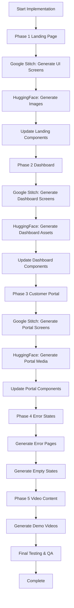

# Frontend Implementation Plan: Google Stitch MCP & HuggingFace MCP

## Executive Summary

This plan outlines the implementation of the RoofManager frontend using **Google Stitch MCP** for UI generation and **HuggingFace MCP** for media generation. The roofing business management system requires a modern, visually appealing interface with consistent branding and high-quality media assets.

**Current Stack:**
- Next.js 14 with TypeScript
- Tailwind CSS for styling
- Framer Motion for animations
- Dark theme with Ghana-inspired color palette

---

## Part 1: Google Stitch MCP - UI Generation Strategy

### 1.1 Available Google Stitch Tools

| Tool | Purpose |
|------|---------|
| `create_project` | Initialize a new UI project within Stitch |
| `generate_screen_from_text` | Generate UI screens from text descriptions |
| `edit_screens` | Modify existing generated screens |
| `generate_variants` | Create responsive/design variants |

### 1.2 Screen Architecture

```
┌─────────────────────────────────────────────────────────────────┐
│                    RoofManager Screen Hierarchy                  │
├─────────────────────────────────────────────────────────────────┤
│                                                                  │
│  ┌─────────────────┐                                            │
│  │   Landing Page  │                                            │
│  │  ┌───────────┐  │                                            │
│  │  │  Hero     │  │  ┌──────────────────────────────────────┐   │
│  │  ├───────────┤  │  │           Dashboard                 │   │
│  │  │ Features  │  │  │  ┌────────┐ ┌───────┐ ┌────────┐   │   │
│  │  ├───────────┤  │  │  │Analytics│ │ Jobs  │ │Estimates│   │   │
│  │  │ Pricing   │  │  │  ├────────┤ ├───────┤ ├────────┤   │   │
│  │  ├───────────┤  │  │  │Invoices │ │ Leads │ │Payments │   │   │
│  │  │Testimonials│  │  │  └────────┘ └───────┘ └────────┘   │   │
│  │  └───────────┘  │  └──────────────────────────────────────┘   │
│  └─────────────────┘                                            │
│                                                                  │
│  ┌─────────────────────────────────────┐                        │
│  │       Customer Portal               │                        │
│  │  ┌────────┐ ┌───────┐ ┌─────────┐   │                        │
│  │  │ Quotes │ │ Jobs  │ │Invoices │   │                        │
│  │  └────────┘ └───────┘ └─────────┘   │                        │
│  └─────────────────────────────────────┘                        │
│                                                                  │
└─────────────────────────────────────────────────────────────────┘
```

### 1.3 Screen Specifications for Google Stitch

#### 1.3.1 Landing Page Screens

**Screen 1: Hero Section**
```
Description: Modern dark-themed hero section for roofing SaaS
Components:
- Headline: "Roofing Management, Redefined."
- Subhead: AI-driven monitoring and drone integration
- CTA Buttons: "Get Started Free", "Watch Demo"
- Stats: 2,500+ Businesses, 45k+ Roofs Managed, 98% Satisfaction
- Visual: Interactive dashboard mockup
Style: Dark theme, Ghana colors (red #EF2B2D, gold #FFD700, green #009E49)
```

**Screen 2: Features Grid**
```
Description: 6-feature grid showcasing platform capabilities
Components:
1. AI-Powered Inspections - Computer vision detection
2. Drone Integration - Aerial imagery capture
3. Real-Time Alerts - Instant notifications
4. Thermal Mapping - Heat loss analysis
5. Secure Data Storage - Enterprise encryption
6. Team Collaboration - Multi-user access
Style: Consistent with landing page, hover animations
```

**Screen 3: Pricing Section**
```
Description: 3-tier pricing cards (Starter, Professional, Enterprise)
Components:
- Pricing cards with feature lists
- Toggle for monthly/yearly billing
- CTA buttons for each tier
Style: Professional, clean, accent colors for highlight
```

**Screen 4: Testimonials**
```
Description: Customer testimonials section
Components:
- Avatar images (generated via HuggingFace)
- Quote text
- Customer name and company
- Star ratings
Style: Social proof focused, trust-building
```

#### 1.3.2 Dashboard Screens

**Screen 5: Analytics Dashboard**
```
Description: Main analytics overview
Components:
- Revenue charts (Recharts)
- Job pipeline visualization
- Key metrics cards
- Recent activity feed
Style: Data-heavy, clean, professional
```

**Screen 6: Jobs Management**
```
Description: Job listing and management
Components:
- Job cards with status
- Filter/search functionality
- Add new job button
- Job detail view
Style: Task-focused, actionable
```

**Screen 7: Estimates/Quotes**
```
Description: Estimate creation and management
Components:
- Form inputs for customer info
- Line items for materials/labor
- Calculated totals
- Export/send functionality
Style: Form-focused, calculation-heavy
```

**Screen 8: Invoices**
```
Description: Invoice management
Components:
- Invoice list with status
- Create invoice form
- Payment tracking
- Send reminders
Style: Professional, financial-focused
```

**Screen 9: Leads Pipeline**
```
Description: Lead management with kanban view
Components:
- Kanban columns (New, Contacted, Qualified, Converted)
- Lead cards with contact info
- Drag-and-drop functionality
Style: Pipeline visualization, actionable
```

**Screen 10: Payments**
```
Description: Payment processing and tracking
Components:
- Payment list
- Integration with PayStack/Stripe
- Payment modal
- Transaction history
Style: Secure, trust-building, financial
```

#### 1.3.3 Customer Portal Screens

**Screen 11: Customer Dashboard**
```
Description: Customer-facing portal
Components:
- Overview of active jobs
- Pending approvals
- Recent invoices
- Communication hub
Style: Clean, customer-friendly, accessible
```

**Screen 12: Quote Approval**
```
Description: Customer quote review and approval
Components:
- Quote details display
- Line items breakdown
- Accept/Decline buttons
- Digital signature capture
Style: Simple, clear, action-oriented
```

**Screen 13: Job Status**
```
Description: Job progress tracking
Components:
- Timeline view
- Phase completion status
- Photo uploads from crew
- Communication with company
Style: Progress-focused, reassuring
```

### 1.4 Google Stitch Prompt Templates

#### Hero Section Prompt
```
Generate a modern SaaS landing page hero section for a roofing management application called "RoofManager Pro".
Style: Dark theme with professional gradients
Colors: Primary #EF2B2D (red), Secondary #FFD700 (gold), Accent #009E49 (green)
Components:
- Badge: "AI-Powered Roofing Solutions"
- Headline: "Roofing Management, Redefined."
- Subhead: "Leverage AI-driven monitoring and drone integration to transform how you inspect, maintain, and manage commercial and residential roofing systems."
- Two CTA buttons: Primary (gradient red) and Secondary (glassmorphism)
- Stats section with 3 metrics
- Trust badges section
- Right side: Interactive dashboard mockup card with glassmorphism effect
Output: React/Next.js component with Tailwind CSS and Framer Motion animations
```

#### Features Grid Prompt
```
Generate a 6-column features grid section for a roofing management SaaS.
Each feature card should include:
- Icon (use Lucide React icons)
- Title
- Description
- Subtle hover animation
Features to showcase:
1. AI-Powered Inspections - 98% accuracy defect detection
2. Drone Integration - High-resolution aerial imagery
3. Real-Time Alerts - Instant issue notifications
4. Thermal Mapping - Heat loss and moisture detection
5. Secure Data Storage - Enterprise-grade encryption
6. Team Collaboration - Role-based multi-user access
Style: Consistent dark theme, glassmorphism cards, professional look
Output: React component with Tailwind CSS
```

#### Dashboard Analytics Prompt
```
Generate an analytics dashboard screen for a roofing management application.
Components needed:
- Header with page title
- Metrics cards grid (4-6 cards with KPIs)
- Revenue trend chart (use Recharts)
- Jobs pipeline visualization
- Recent activity list
- Sidebar navigation
Style: Data-focused, clean lines, professional, dark theme compatible
Output: Next.js page component with Tailwind CSS
```

#### Jobs Management Prompt
```
Generate a jobs management page for a roofing business.
Features:
- Page header with "Add New Job" button
- Search and filter controls
- Job cards grid/list with status badges
- Each card shows: Job ID, Customer name, Address, Status, Date, Amount
- Status colors: Pending (gold), In Progress (blue), Completed (green), Cancelled (red)
- Mobile responsive layout
Output: React component with Tailwind CSS
```

---

## Part 2: HuggingFace MCP - Media Generation Strategy

### 2.1 Available HuggingFace Tools

| Tool | Purpose |
|------|---------|
| `model_search` | Find appropriate models for tasks |
| `gr1_z_image_turbo_generate` | Fast image generation |
| `Spaces` | Access web interfaces for video generation |

### 2.2 Image Generation Categories

#### 2.2.1 Hero Images (1920x1080px)

| Image | Description | Prompt |
|-------|-------------|--------|
| Hero Dashboard | Modern SaaS dashboard showing roofing management | "Professional dark-themed dashboard interface for roofing management SaaS with roof inspection map, AI analysis badges, job cards, Ghana flag colors red gold green accent, modern tech illustration style, 16:9 aspect ratio" |
| Hero Drone | Aerial drone view with AI overlay | "Aerial drone view of residential roof with AI scanning overlay, heat map showing damaged areas, professional photography style, dramatic lighting, 16:9" |

#### 2.2.2 Feature Icons (200x200px circular)

| Icon | Prompt |
|------|--------|
| AI Inspection | "Drone scanning roof technology illustration, aerial view with AI heat map overlay, blue white vector style, circular icon format, transparent background, clean modern design" |
| Job Management | "Task management board with roof job cards, calendar integration, progress bars, purple white flat design, circular icon, professional corporate style" |
| Customer Portal | "Mobile phone with quote approval interface, digital signature, payment button, green accent colors for success states, circular icon, modern UI" |
| Invoice & Payments | "Invoice document with credit card, Ghana Cedis currency symbol GHS, success checkmark, gold green accents, professional business style, circular icon" |
| SMS Notifications | "SMS notification design with phone, Hubtel-style message, roofing job update, green messaging app colors, circular icon format" |
| Analytics Dashboard | "Data analytics dashboard with charts, graphs, revenue trends, blue teal business intelligence colors, circular icon, modern flat design" |

#### 2.2.3 Testimonial Avatars (100x100px circular)

| Avatar | Prompt |
|--------|--------|
| Male Contractor | "Professional Ghanaian male business person headshot, corporate attire, neutral expression, soft lighting, clean background, 100x100 circular crop, portrait photography" |
| Female Business Owner | "Professional Ghanaian female business owner headshot, corporate suit, friendly confident expression, soft lighting, clean background, 100x100 circular crop" |
| Construction Manager | "Ghanaian construction site manager headshot, professional attire with safety gear hint, confident expression, clean background, 100x100 circular crop" |
| Diverse User | "Professional headshot, diverse business person, corporate attire, neutral expression, clean background, 100x100 circular crop" |

#### 2.2.4 Backgrounds and Graphics

| Asset | Size | Prompt |
|-------|------|--------|
| Pricing Background | 1920x600px | "Abstract geometric pattern SaaS pricing section, subtle roof/shingle motifs, Ghana colors red gold green accents, dark navy gradient background, modern tech seamless pattern" |
| Hero Background Texture | 1920x1080px | "Subtle dark background texture, noise pattern, professional corporate look, slate/navy gradient, no visible shapes, clean modern design" |
| Decorative Accents | Various | "Modern geometric accent shapes, circles and lines, Ghana colors red gold green, subtle transparency, modern tech decorative elements" |

#### 2.2.5 Error and Empty States

| State | Size | Prompt |
|-------|------|--------|
| 404 Error | 500x400px | "404 error illustration, roof construction theme, friendly mascot character, professional design, dark theme compatible, clean modern illustration style" |
| Empty Leads | 300x200px | "Empty leads inbox illustration, folder with question mark, roof business theme, friendly corporate illustration style, clean design" |
| Empty Jobs | 300x200px | "No jobs scheduled illustration, calendar with checkmark, clean modern design, professional corporate style" |
| Empty Invoices | 300x200px | "Empty invoice folder illustration, document stack with ribbon, professional business theme, clean modern illustration" |

#### 2.2.6 Trust and Security Badges

| Badge | Size | Prompt |
|-------|------|--------|
| Security Shield | 150x150px | "Security shield badge with checkmark, GDPR compliant icon, ISO certification style, professional flat design, transparent background" |
| SSL Secure | 150x150px | "SSL security badge, lock icon, secure connection symbol, professional badge design, transparent background" |
| 24/7 Support | 150x150px | "24/7 support badge, headset icon, customer service symbol, professional badge design, green accent colors" |
| Mobile Ready | 150x150px | "Mobile app ready badge, smartphone icon, responsive design symbol, modern flat badge, transparent background" |

### 2.3 Video Generation Strategy

#### 2.3.1 Demo Video Content

| Video | Duration | Purpose |
|-------|----------|---------|
| Platform Overview | 60-90s | Show main features and benefits |
| Quick Start Guide | 2-3min | Tutorial for new users |
| Feature Spotlight | 30-45s | Highlight specific capabilities |
| Customer Testimonial | 45-60s | Social proof video |

#### 2.3.2 Video Generation Prompts

**Platform Overview Video Script:**
```
Scene 1 (0-10s): Hero shot with logo animation
Scene 2 (10-30s): Dashboard walkthrough with smooth transitions
Scene 3 (30-50s): Drone inspection demo with AI overlay
Scene 4 (50-70s): Customer portal showing quote approval
Scene 5 (70-90s): Team using app on various devices
Style: Professional, modern, fast-paced but clear
```

**Quick Start Guide Structure:**
```
Segment 1: Account Setup (30s)
- Registration flow
- Company profile setup
- Team invitation

Segment 2: First Job (45s)
- Create new job
- Add customer details
- Upload photos

Segment 3: Generate Quote (45s)
- Select materials
- Calculate pricing
- Send to customer

Segment 4: Track Progress (30s)
- Update job status
- Add notes
- Complete job
```

### 2.4 HuggingFace Model Selection

| Task | Recommended Model | Reason |
|------|-------------------|--------|
| Hero Images | FLUX.1-schnell | Fast, high quality, free |
| Feature Icons | Stable Diffusion XL | Detail control, icon quality |
| Testimonial Avatars | FLUX.1-dev | Portrait quality |
| Backgrounds | Stable Diffusion 3 | Pattern consistency |
| Video Generation | Zeroscope / ModelScope | Text-to-video capabilities |

---

## Part 3: Implementation Roadmap

### Phase 1: Landing Page Enhancement (Priority 1)

#### Step 1.1: Generate Landing Page UI with Google Stitch

```
Actions:
1. Use generate_screen_from_text for Hero Section
2. Use generate_screen_from_text for Features Grid
3. Use generate_screen_from_text for Pricing Section
4. Use generate_screen_from_text for Testimonials
5. Generate responsive variants for mobile

Files to create/update:
- frontend/components/landing/LandingHero.tsx
- frontend/components/landing/FeaturesSection.tsx
- frontend/components/landing/PricingSection.tsx
- frontend/components/landing/Testimonials.tsx
- frontend/components/landing/TrustBadges.tsx
```

#### Step 1.2: Generate Landing Page Media with HuggingFace

```
Actions:
1. Generate hero dashboard image (1920x1080)
2. Generate 6 feature icons (200x200 each)
3. Generate 4 testimonial avatars (100x100 each)
4. Generate pricing background (1920x600)
5. Generate trust badges (4 x 150x150)
6. Generate decorative accent shapes

Output location: public/images/landing/
```

### Phase 2: Dashboard UI Generation (Priority 2)

#### Step 2.1: Generate Dashboard Screens

```
Actions:
1. Generate Analytics Dashboard screen
2. Generate Jobs Management screen
3. Generate Estimates screen
4. Generate Invoices screen
5. Generate Leads Pipeline screen
6. Generate Payments screen
7. Generate mobile responsive variants

Files to create/update:
- frontend/app/(dashboard)/analytics/page.tsx
- frontend/app/(dashboard)/jobs/page.tsx
- frontend/app/(dashboard)/estimates/page.tsx
- frontend/app/(dashboard)/invoices/page.tsx
- frontend/app/(dashboard)/leads/page.tsx
- frontend/app/(dashboard)/payments/page.tsx
```

#### Step 2.2: Generate Dashboard Media

```
Actions:
1. Generate dashboard illustration for empty states
2. Generate status indicator icons (pending, complete, etc.)
3. Generate payment method icons (PayStack, Stripe)
4. Generate chart placeholder images
5. Generate file type icons (PDF, image, etc.)

Output location: public/images/dashboard/
```

### Phase 3: Customer Portal (Priority 3)

#### Step 3.1: Generate Customer Portal Screens

```
Actions:
1. Generate Customer Dashboard screen
2. Generate Quote Approval screen
3. Generate Job Status screen
4. Generate Invoice View screen
5. Generate responsive mobile variants

Files to create/update:
- frontend/app/customer/[token]/page.tsx
- frontend/app/customer/[token]/quote/[quoteId]/page.tsx
- frontend/app/customer/[token]/job/[jobId]/page.tsx
- frontend/app/customer/[token]/invoice/[invoiceId]/page.tsx
```

#### Step 3.2: Generate Customer Portal Media

```
Actions:
1. Generate customer onboarding illustrations
2. Generate quote document template graphics
3. Generate progress tracking graphics
4. Generate success/completion images
5. Generate signature capture placeholder

Output location: public/images/customer/
```

### Phase 4: Error States and Utilities (Priority 4)

#### Step 4.1: Generate Error Pages

```
Actions:
1. Generate 404 error page with roof theme
2. Generate 500 error page
3. Generate access denied page
4. Generate loading state animations
5. Generate skeleton loader graphics

Files to create/update:
- frontend/app/error.tsx
- frontend/app/not-found.tsx
- frontend/app/layout.tsx (loading states)
```

#### Step 4.2: Generate Empty State Images

```
Actions:
1. Generate "No Leads" illustration
2. Generate "No Jobs" illustration
3. Generate "No Invoices" illustration
4. Generate "No Customers" illustration
5. Generate "Search No Results" illustration

Output location: public/images/empty-states/
```

### Phase 5: Video Content (Priority 5 - Optional)

#### Step 5.1: Generate Demo Videos

```
Actions:
1. Generate platform overview video
2. Generate quick start guide video
3. Generate feature spotlight videos
4. Generate customer testimonial video

Output location: public/videos/
```

---

## Part 4: File Structure After Implementation

```
frontend/
├── public/
│   ├── images/
│   │   ├── landing/
│   │   │   ├── hero-dashboard.webp
│   │   │   ├── hero-drone.webp
│   │   │   ├── feature-ai-inspection.webp
│   │   │   ├── feature-drone.webp
│   │   │   ├── feature-alerts.webp
│   │   │   ├── feature-thermal.webp
│   │   │   ├── feature-storage.webp
│   │   │   ├── feature-collaboration.webp
│   │   │   ├── avatar-1.webp
│   │   │   ├── avatar-2.webp
│   │   │   ├── avatar-3.webp
│   │   │   ├── avatar-4.webp
│   │   │   ├── pricing-background.webp
│   │   │   ├── trust-security.webp
│   │   │   ├── trust-ssl.webp
│   │   │   ├── trust-support.webp
│   │   │   └── trust-mobile.webp
│   │   ├── dashboard/
│   │   ├── customer/
│   │   └── empty-states/
│   └── videos/
│       ├── demo-overview.mp4
│       ├── quick-start.mp4
│       └── feature-spotlight.mp4
├── app/
│   ├── (dashboard)/
│   │   ├── analytics/page.tsx (updated)
│   │   ├── jobs/page.tsx (updated)
│   │   ├── estimates/page.tsx (updated)
│   │   ├── invoices/page.tsx (updated)
│   │   ├── leads/page.tsx (updated)
│   │   └── payments/page.tsx (updated)
│   ├── customer/
│   │   └── [token]/ (updated components)
│   └── components/
│       └── landing/
│           ├── LandingHero.tsx (updated)
│           ├── FeaturesSection.tsx (updated)
│           ├── PricingSection.tsx (updated)
│           └── Testimonials.tsx (updated)
```

---

## Part 5: Execution Checklist

### Pre-Execution
- [ ] Verify Google Stitch MCP connection
- [ ] Verify HuggingFace MCP connection
- [ ] Review existing component structures
- [ ] Prepare image generation prompts
- [ ] Set up Cloudinary account for asset hosting

### Phase 1: Landing Page
- [ ] Generate hero section UI with Google Stitch
- [ ] Generate features grid UI with Google Stitch
- [ ] Generate pricing section UI with Google Stitch
- [ ] Generate testimonials UI with Google Stitch
- [ ] Generate hero image with HuggingFace
- [ ] Generate 6 feature icons with HuggingFace
- [ ] Generate 4 testimonial avatars with HuggingFace
- [ ] Generate pricing background with HuggingFace
- [ ] Generate 4 trust badges with HuggingFace
- [ ] Update landing page components with new assets
- [ ] Test responsive behavior

### Phase 2: Dashboard
- [ ] Generate analytics dashboard UI with Google Stitch
- [ ] Generate jobs management UI with Google Stitch
- [ ] Generate estimates UI with Google Stitch
- [ ] Generate invoices UI with Google Stitch
- [ ] Generate leads pipeline UI with Google Stitch
- [ ] Generate payments UI with Google Stitch
- [ ] Generate dashboard empty state images
- [ ] Generate status indicator icons
- [ ] Generate payment method icons
- [ ] Update dashboard components
- [ ] Test dashboard functionality

### Phase 3: Customer Portal
- [ ] Generate customer dashboard UI with Google Stitch
- [ ] Generate quote approval UI with Google Stitch
- [ ] Generate job status UI with Google Stitch
- [ ] Generate customer onboarding illustrations
- [ ] Generate quote document graphics
- [ ] Update customer portal components
- [ ] Test customer portal flow

### Phase 4: Error States
- [ ] Generate 404 error page
- [ ] Generate 500 error page
- [ ] Generate empty state illustrations
- [ ] Generate loading animations
- [ ] Update error handling components

### Phase 5: Video Content (Optional)
- [ ] Generate platform overview video
- [ ] Generate quick start guide video
- [ ] Generate feature spotlight videos
- [ ] Update landing page with video content

---

## Part 6: Integration Workflow



---

## Part 7: Color Palette Reference

| Color Name | Hex Code | Usage |
|-------------|----------|-------|
| Ghana Red | #EF2B2D | Primary CTA, highlights, important actions |
| Ghana Gold | #FFD700 | Success states, achievements, accents |
| Ghana Green | #009E49 | Positive actions, confirmed states |
| Slate 900 | #0F172A | Dark background primary |
| Slate 800 | #1E293B | Dark background secondary |
| Slate 50 | #F8FAFC | Light text primary |
| Slate 300 | #CBD5E1 | Light text secondary |

---

## Part 8: Technical Notes

### Google Stitch Integration
- Use `generate_screen_from_text` with detailed component specifications
- Request Tailwind CSS output for compatibility
- Ask for Framer Motion animations in components
- Request responsive variants using `generate_variants`

### HuggingFace Integration
- Use `model_search` to find best models for specific tasks
- Use `gr1_z_image_turbo_generate` for fast iterations
- Reference existing prompts from `plans/frontend_image_prompts.md`
- Optimize images for web (WebP format, compression)

### Asset Optimization
- Hero images: 1920x1080px, WebP, max 500KB
- Icons: 200x200px, PNG lossless, max 100KB
- Avatars: 100x100px, circular crop, WebP, max 50KB
- Backgrounds: 1920x1080px, WebP, max 800KB
- Videos: MP4, optimized compression

---

## Part 9: Next Steps

1. **Review and approve** this implementation plan
2. **Switch to Code mode** to begin execution
3. **Execute Phase 1**: Landing page UI and media generation
4. **Test and iterate** on generated assets
5. **Proceed through phases** sequentially
6. **Final QA** and deployment

---

*Plan created: 2026-02-12*
*Project: RoofManager Frontend Implementation*
*Tools: Google Stitch MCP, HuggingFace MCP*
